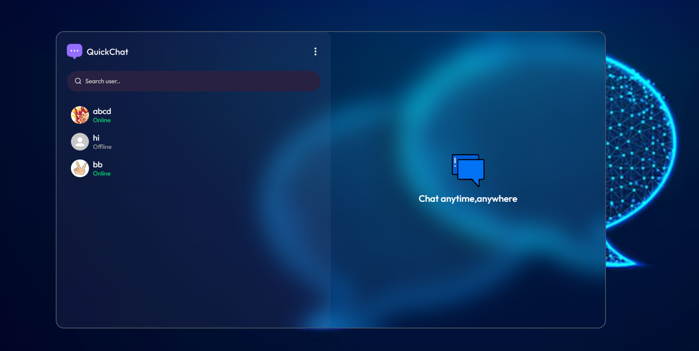

# ChatApp = ChatCircuit 💬

A full-stack real-time chat application built with React (Vite) on the frontend and Express + MongoDB + Socket.io on the backend. It supports authentication (signup/login), real-time messaging (text and images), editing & deleting messages, profile updates, online presence indicators, and an intuitive sidebar + message pane layout.

---
<p align="center">
  
</p>

---

## 🚀 Quick Overview

**ChatCircuit** is a lightweight, developer-friendly chat application that demonstrates common chat app patterns: JWT-based authentication, REST APIs for user and message operations, file/image upload via Cloudinary, and real-time message delivery and updates using Socket.io.

## ✅ Features

- **User Authentication:** Secure signup, login, and JWT-protected routes.
- **Profile Management:** Update full name, bio, and profile pictures.
- **Real-time Chatting:** Utilizes Socket.io for instantaneous message delivery and online presence (green dot).
- **Text & Media Messaging:** Send standard text or upload images directly to Cloudinary.
- **Message Controls:** Edit existing messages or Delete them for both users in real-time.
- **Read Receipts:** Unseen message counts and automatic marking of messages as seen.
- **Responsive UI:** A dynamic Sidebar for users, a central Chat Container, and a Right Sidebar for profile & media sharing.
- **Minimal Context State:** Avoids Redux by utilizing powerful React Contexts (`AuthContext` & `ChatContext`).

## 🔧 Tech Stack

**Frontend**
- **React (Vite)**: Lightning-fast development environment and optimized production builds.
- **Tailwind CSS**: Utility-first CSS framework for rapid UI styling.
- **Socket.io-client**: For receiving real-time WebSocket events from the server.
- **React Router DOM**: Client-side routing.
- **Zustand / Context API**: Simple state management.

**Backend**
- **Node.js runtime & Express.js framework**: Robust and scalable routing.
- **MongoDB & Mongoose ODM**: NoSQL database for flexible data schemas (Users, Messages).
- **Socket.io**: Real-time bidirectional event-based communication.
- **Cloudinary SDK**: Cloud-based image and media storage.
- **JWT (JSON Web Tokens)**: Stateless and secure user authentication.
- **Bcryptjs**: Password hashing and security.

## 📁 Folder Structure

```text
chatAPP/
├── client/                     # Frontend React (Vite) Application
│   ├── public/                 # Static assets (including screenshots like ss.png)
│   ├── src/
│   │   ├── assets/             # Internal UI icons and images
│   │   ├── components/         # Reusable structural components (Sidebar, ChatContainer)
│   │   ├── context/            # AuthContext and ChatContext for global state
│   │   ├── lib/                # Utility functions (time formatting, etc.)
│   │   ├── pages/              # Primary route pages (HomePage, LoginPage, ProfilePage)
│   │   ├── App.jsx             # Main application entry and router setup
│   │   └── index.css           # Global Tailwind CSS styles
│   ├── .env                    # Frontend environment variables
│   └── package.json            # Frontend dependencies
│
└── server/                     # Backend Node.js/Express Application
    ├── controllers/            # Route logic (authController, messageController)
    ├── lib/                    # Database, Cloudinary config, and utilities
    ├── middleware/             # Route protection and JWT verification
    ├── models/                 # Mongoose Data Schemas (User.js, Message.js)
    ├── routes/                 # Express API Route definitions
    ├── server.js               # Main entry point, Socket.io initialization, and CORS setup
    ├── .env                    # Backend environment variables
    └── package.json            # Backend dependencies
```

## ⚙️ Environment & Setup

Create a `.env` file in the **`server`** directory with the following variables:

```env
PORT=5000
MONGODB_URI=<your-mongodb-connection-string>
JWT_SECRET=<a-strong-secret-key>
CLOUDINARY_CLOUD_NAME=<your_cloud_name>
CLOUDINARY_API_KEY=<your_api_key>
CLOUDINARY_API_SECRET=<your_api_secret>
```

Create a `.env` file in the **`client`** directory (if running client and server separately):

```env
VITE_BACKEND_URL=http://localhost:5000
```

## 🧭 How to Run Locally

Because the project is structured as a Monorepo, you need to run both the Frontend and the Backend servers simultaneously. 

### 1. Start the Backend Server
Open a terminal and navigate to the `server` folder. Install the dependencies, and start the development server.

```bash
cd server
npm install
npm run dev
```
*The backend should now be running on `http://localhost:5000` (and connected to MongoDB).*

### 2. Start the Frontend Client
Open a **new, separate terminal tab** and navigate to the `client` folder. Install the dependencies, and start the Vite development server.

```bash
cd client
npm install
npm run dev
```
*Vite will provide a local URL (typically `http://localhost:5173`). Open this link in your browser to interact with the application!*

## 🔗 Core API Endpoints

- **Auth**
  - `POST /api/auth/signup` — Register a new user
  - `POST /api/auth/login` — Login and receive a JWT
  - `GET /api/auth/check-auth` — Validate current session token
  - `PUT /api/auth/update-profile` — Update user profile data & picture
- **Messages**
  - `GET /api/messages/users` — Retrieve all users for the sidebar
  - `GET /api/messages/:id` — Get conversation history with a specific user
  - `POST /api/messages/send/:id` — Send a new text/image message
  - `PUT /api/messages/edit/:id` — Edit an existing message
  - `DELETE /api/messages/delete/:id` — Delete a message
  - `PUT /api/messages/mark/:id` — Mark a message as read (seen)

## 🤝 Contributing

Contributions, issues, and feature requests are welcome!
1. Fork the repository
2. Create your feature branch (`git checkout -b feature/AmazingFeature`)
3. Commit your changes (`git commit -m 'Add some AmazingFeature'`)
4. Push to the branch (`git push origin feature/AmazingFeature`)
5. Open a Pull Request
